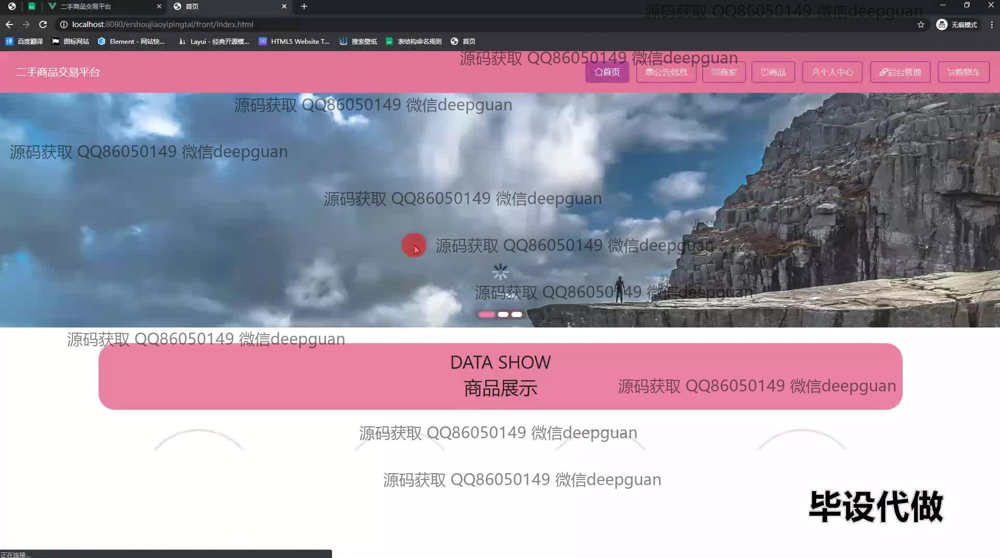
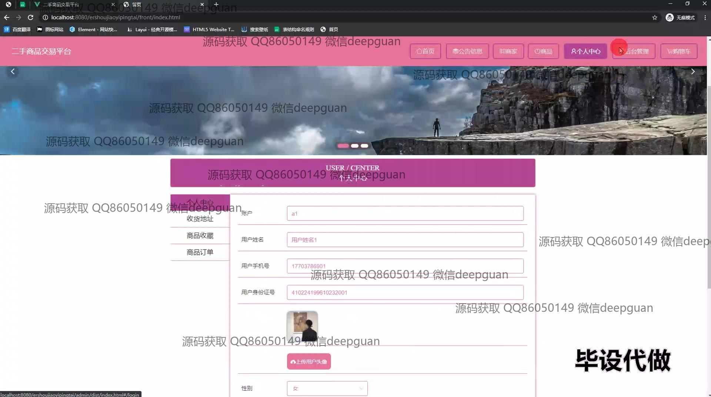

<h1 align="center">二手商品交易平台+vue</h1>

## 简介
二手商品交易平台：角色分为管理员、用户；功能包括商品管理、会员等级管理、购物车、订单管理、用户信息编辑与地址管理、商品评价及公告信息管理。    --计算机毕业设计源码；毕设源码；java毕业设计源码

## 联系方式

<h3 align="center">获取完整代码与数据库文件 + 微信：deepguan QQ: 86050149 QQ群: 783742310</h3>

<h3 align="center">可帮忙远程部署 包运行成功！提供远程部署、修改代码、设计文档指导、代码讲解等服务！</h3>

## 功能介绍（完整见运行截图）
管理员：提供用户管理、商品管理、订单管理及公告管理功能。支持对会员等级进行管理，调整会员折扣信息；在平台内，可以查看商品评价，进行评价回复及管理评论；公告信息管理功能可用来发布、查看和修改公告信息；后台提供商品上下架、详情修改及订单查询等操作；管理员可以登录平台查看个人信息并进行修改，支持密码重置以及用户角色配置。

用户：可以注册并登录平台，浏览商品列表，进行商品搜索及查看商品详情；在购物车中管理待购买商品，并在结算时进行模拟付款；用户中心提供个性化操作，通过查看及修改个人信息、收货地址和账户设置，管理订单信息及商品收藏；支持用户对产品进行评价，并查看他人评价以决定购买；用户还可以通过公告栏查看最新平台公告及相关资讯，保持信息更新。

## 运行截图

本代码来源于网络,仅供学习参考使用!

